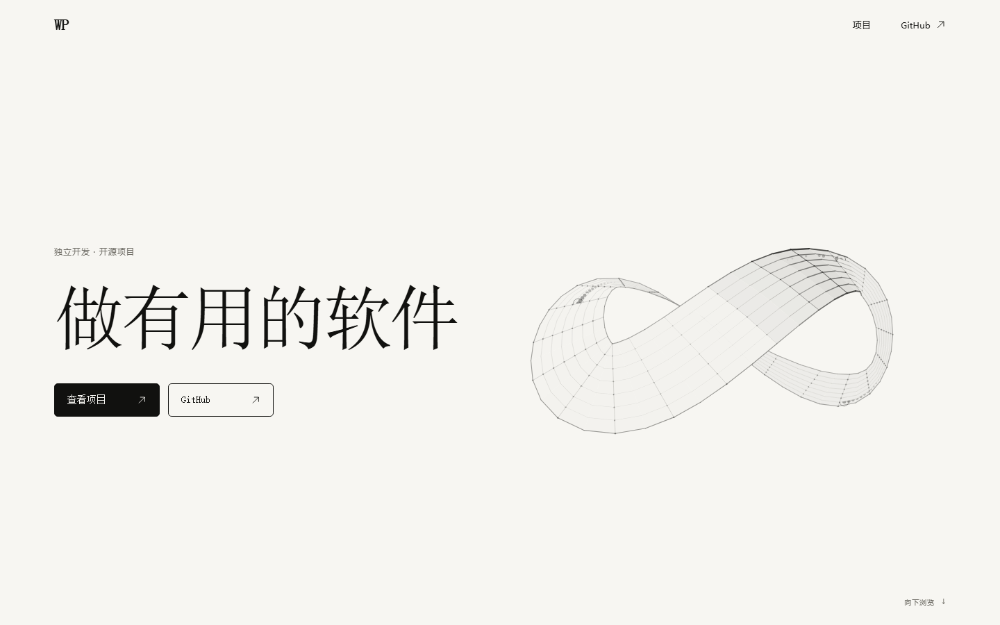
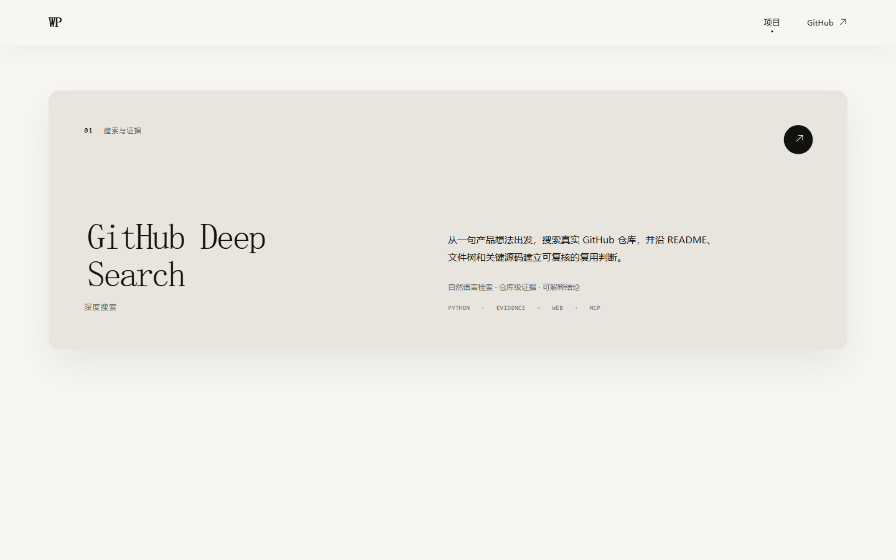

# WP Homepage

一个克制、中文优先的开源个人主页，用一页讲清楚作品与工程判断。

> 做有用的软件

[在线访问](https://wp-i.github.io/wp-homepage/) · [项目遴选标准](docs/PROJECT_SELECTION.md)



## 亮点

- **代码生成的交互式莫比乌斯环**：Canvas 实时绘制，响应指针移动与自动旋转；不依赖图片、视频或三维运行库。
- **以证据决定作品顺序**：从问题价值、技术深度、交付完整度、工程质量、证据质量和技术表达六个维度评分，新项目加入时统一复评。
- **克制的单页叙事**：暖白画布、编辑式字体尺度、纯文字项目和滚动渐入共同构成页面节奏，没有多余章节与装饰性项目配图。
- **静态、轻量、可审计**：没有后端、账户、分析脚本、远程字体、运行时 GitHub API 或第三方视觉资产。
- **桌面浏览器质量门槛**：覆盖 1024–1920 px 的主流桌面分辨率，并验证 Chrome、Edge、Firefox、WebKit、键盘导航和减少动态效果模式。



## 展示项目

1. [GitHub Deep Search](https://github.com/wp-i/github-deep-search) — 从产品想法出发，搜索真实 GitHub 仓库并形成可复核的复用判断。
2. [Nodestitch](https://github.com/wp-i/nodestitch) — 纯本地的 Windows 单轴时间线任务规划工具。
3. [SwordShield Notes](https://github.com/wp-i/swordshield-notes) — 面向 Windows 桌面的本地优先双分组任务工具。
4. [Comment Vision Claw](https://github.com/wp-i/comment-vision-claw) — 热评抓取、截图、分析与 PDF 报告工作流。

展示顺序由[项目遴选标准](docs/PROJECT_SELECTION.md)自动决定，不按创建时间、星标或个人偏好手工排列。

## 技术实现

- React 19 / TypeScript / Vite
- CSS Modules / Canvas / IntersectionObserver
- Vitest / Testing Library / Playwright
- GitHub Actions / GitHub Pages

莫比乌斯环、箭头和动效均由浏览器原生能力生成。页面遵循 `prefers-reduced-motion`，内容在动画或观察器不可用时仍完整可见。

## 本地开发

需要 Node.js 22.12 或更高版本。

```bash
npm install
npm run dev
```

完整质量检查：

```bash
npm run lint
npm run typecheck
npm test
npm run build
npm run test:e2e
```

首次运行 E2E 前安装浏览器：

```bash
npx playwright install
```

## 支持范围

项目仅面向桌面浏览器，最低支持宽度为 1024 CSS px。自动化验证覆盖 Chrome 的 1024×768、1280×720、1366×768、1440×900、1920×1080，以及 Edge、Firefox、WebKit 的 1366×768。

## 设计与工程约束

- [Architecture](docs/ARCHITECTURE.md)
- [Design system](docs/DESIGN_SYSTEM.md)
- [Project selection standard](docs/PROJECT_SELECTION.md)
- [Agent rules](AGENTS.md)
- [Contributing](CONTRIBUTING.md)

[Xiaomi MiMo](https://mimo.mi.com/) 是视觉完成度与交互质感的核心参考，但本项目与 Xiaomi 没有关联，也不使用或重新分发其商标、源码、专有字体、文案或视觉资产。

## 部署

推送到 `main` 后，GitHub Actions 构建并发布 `dist/` 到 GitHub Pages。Vite 使用相对资源路径，因此仓库子路径与后续自定义域名可复用同一构建产物。

## License

[MIT](LICENSE) © 2026 WP
